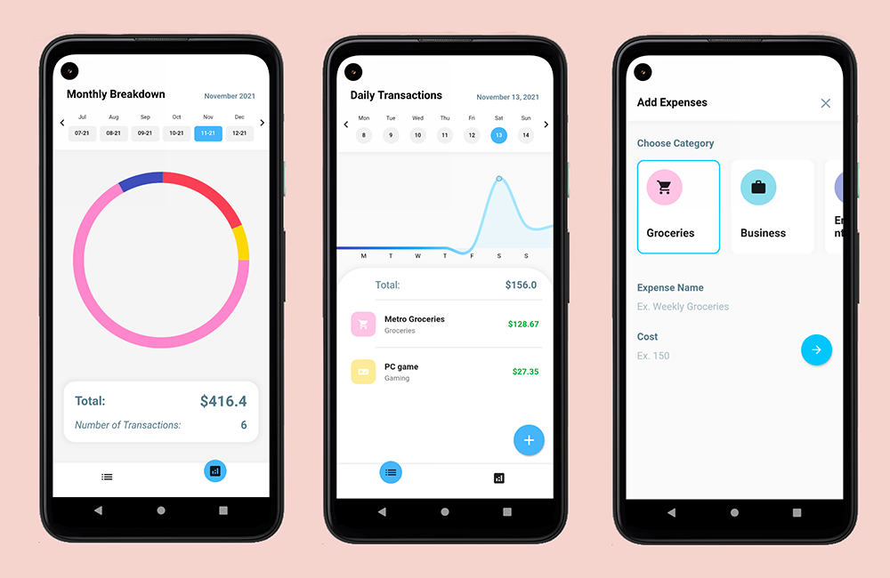
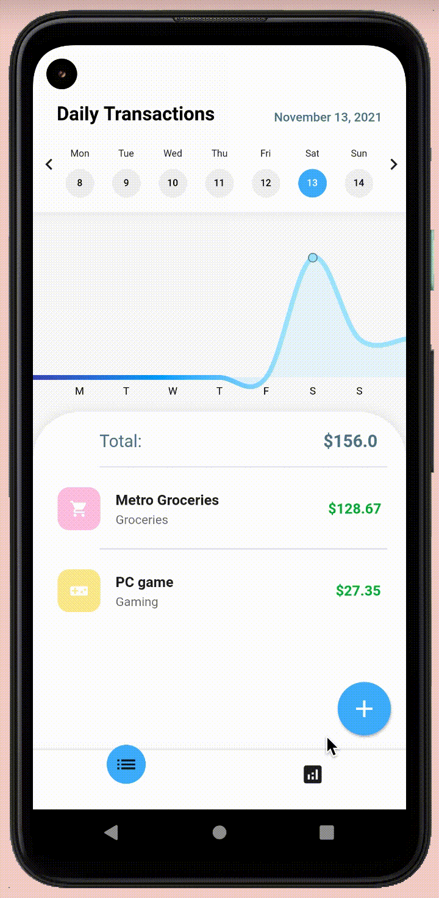
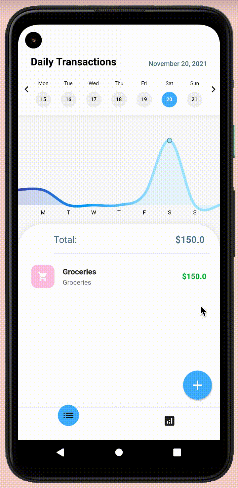
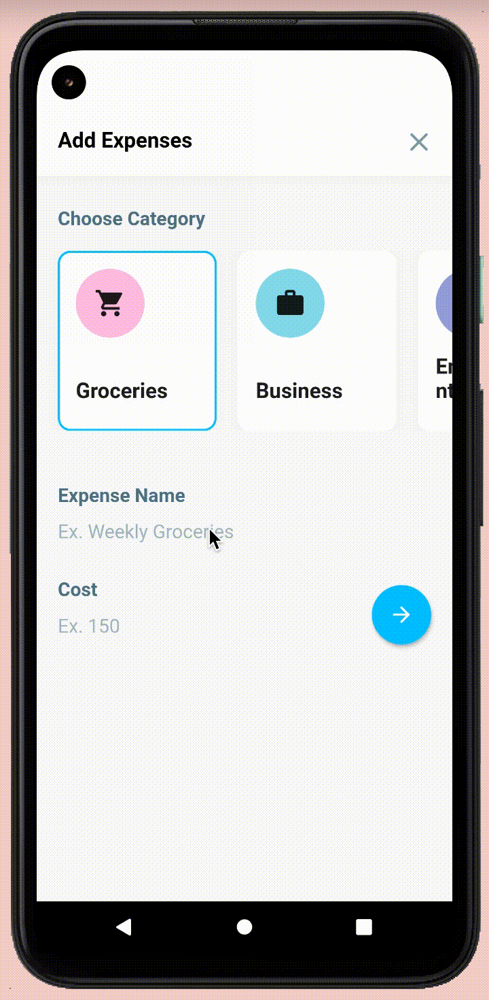

# Finance Manager Application
 

  

## Introduction
Application facilitating user expense transaction analytics, helps users understand how much money they are spending on various categories over time (groceries, meals, entertainment etc). 

**Credits**: Athiru Pathiraja, Neel Faucher

Tested for Android & iOS

## Technologies
Front End: Built using [Flutter app development framework](https://flutter.dev/). Flutter is a cross-platform hybrid app development platform which allows for a native applications to be built for i0S, Android, desktop and the web using a single codebase.

Back End: [Cloud Firestore](https://firebase.google.com/products/firestore) back end to store, sync and query transaction data for unique users. Cloud Firestore is a NoSQL document database for mobile applications. 

#### Plugins: 
- cloud_firestore: ^2.5.0
- provider: ^5.0.0
- fl_chart: ^0.36.1
- intl: ^0.17.0

## Features & Architecture

### Daily Transactions Page (Launch Screen): 
**Description:** List of transactions in a given day and overview of weekly expenses Application opens to list of expenses for the current date (synced with user’s date and time). 

**Architecture:**
- This page is a stateful widget that refreshes on the switching between weeks. For each state, transaction data (including category, price, time & date) of the current week are queried, synced and localized (using provider) for effective and simplified allocation & disposal of resources
- For each day of the week, the transaction data is constructed into iterables and sorted (using merge sort) with the most recent transaction at the beginning. 

**Navigation Bar:** Quick access to individual expenses for the user’s current week with toggles for previous weeks. 

### Monthly Transactions Page: 

**Description:** Pie chart showing categorized breakdown of monthly transaction

**Architecture:**
* This page is a stateful widget that refreshes on switching between the 6months provided in its navigation bar. For each state, the total monthly transactions, total transactions for each category, and number of transactions are queried and localized.
* Using change notifier and provider, this widget listens to the latest value of localized transaction data in the “Daily Transaction” widget, and updates its local widgets. In addition, it listens to any expenses that are added using the “Add Transaction” widget.

**Navigation Bar:** Quick access to monthly expenses in six month increments with toggles for previous months.

### Add Transactions Page: 

**Description:** Add a transaction in real time, with a category label and value of transaction. 

**Architecture:**
- This page is a stateful widget that notifies listeners and updates localized data on a button press (labelled ‘+’)
- Upon adding an expense, this widget parses the user inputed data and stores a new document in the database with a specific identifier (based on the inputted data).

## Screens

### Monthly Breakdown | Daily Transactions | Add Transaction

  
  
  

